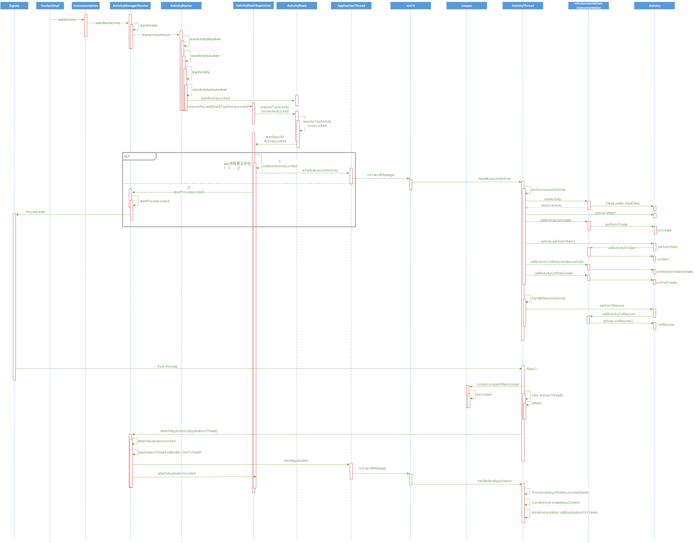

---
title: Android Framework之Activity启动流程(一)
urlname: android_framework_start_activity_1
categories:
- android
tags: [Frameworks,Android]
---

</br>
*<font size=4px color="#555555">本文的分析基于Android 8.1源码。</font>*
</br>本文章将分三篇为大家讲解。
第二篇：[Android Framework之Activity启动流程(二)](https://pomelojiang.github.io/android_framework_start_activity_2)
第三篇：[Android Framework之Activity启动流程(三)](https://pomelojiang.github.io/android_framework_start_activity_3)


在文章的起始，插张时序图,先看结论再看过程。（右键-新标签页打开）
<!-- more -->


</br>
</br>
## Zygote
在Android系统中，是由ActivityManagerService负责为应用程序创建新进程的。至于ActivityManagerService本身进程，则是由Zygote负责启动。
Zygote翻译成中文，是受精卵。至于为啥叫这个名字，问设计Android系统的攻城狮去……
哈哈哈，开个玩笑。。。  
  
在Android中，大部分的应用进程都是由zygote来创建的，是不是跟受精卵的职责有点类似, emmm……
我们来看看Zygote是如何创建ActivityManagerService进程的。


frameworks/base/core/java/com/android/internal/os/ZygoteInit.java

```java
public static void main(String argv[]) {
	……
	//这句话大概可以猜出zygote和其他进程是通过Socket来通信的
  zygoteServer.registerServerSocket(socketName);
  ……
  boolean startSystemServer = false;
	for (int i = 1; i < argv.length; i++) {
        if ("start-system-server".equals(argv[i])) {
          startSystemServer = true;
          ……
        }else if {
        }
  }
  ……

  if (startSystemServer) {
    //在forkSystemServer中fork system server进程
    Runnable r = forkSystemServer(abiList, socketName, zygoteServer);
    ……
  }
}

/**
 * Prepare the arguments and forks for the system server process.
 *
 * Returns an {@code Runnable} that provides an entrypoint into system_server code in the
 * child process, and {@code null} in the parent.
 */
private static Runnable forkSystemServer(String abiList, String socketName,
        ZygoteServer zygoteServer) {

        // …… 我是可爱的省略号 (*╹▽╹*)
        int pid;

        try {
            parsedArgs = new ZygoteConnection.Arguments(args);
            ZygoteConnection.applyDebuggerSystemProperty(parsedArgs);
            ZygoteConnection.applyInvokeWithSystemProperty(parsedArgs);

        /* Request to fork the system server process */
        //重点来了,通过Zygote的静态方法来fork sytem server进程
            pid = Zygote.forkSystemServer(
                    parsedArgs.uid, parsedArgs.gid,
                    parsedArgs.gids,
                    parsedArgs.debugFlags,
                    null,
                    parsedArgs.permittedCapabilities,
                    parsedArgs.effectiveCapabilities);
        } catch (IllegalArgumentException ex) {
            throw new RuntimeException(ex);
        }

        /* For child process */
        if (pid == 0) {
            if (hasSecondZygote(abiList)) {
                waitForSecondaryZygote(socketName);
            }
            zygoteServer.closeServerSocket();
            return handleSystemServerProcess(parsedArgs);
        }
        return null;
}
```

接下来就不进去看了，贴个Zygote.forkSystemServer方法的注释吧

```
/**
     * Special method to start the system server process. In addition to the
     * common actions performed in forkAndSpecialize, the pid of the child
     * process is recorded such that the death of the child process will cause
     * zygote to exit.
*/
```
SystemServer进程启动时，会顺带初始化ActivityManagerService，代码这里就不贴了，大家自己去搜就行。
路径：frameworks/base/services/java/com/android/server/SystemServer.java
搜索关键字： ActivityManagerService

</br>
</br>
## Context.startActivity()


当我们需要打开一个Activity时，是不是经常这样干。
这里的Context并不是Context类，真正干活的是ContextImpl。
我们来看看具体的代码
```java
@Override
public void startActivity(Intent intent, Bundle options) {
    // ……我是省略号
    mMainThread.getInstrumentation().execStartActivity(
            getOuterContext(), mMainThread.getApplicationThread(), null,
            (Activity) null, intent, -1, options);
}
```
</br>
</br>
## Instrumentation  

ContextImpl又雇佣了Instrumentation来帮它干活。
来看看具体的细节：
frameworks/base/core/java/android/app/Instrumentation.java
看看官方对Instrumentation的解释：
https://developer.android.com/reference/android/app/Instrumentation.html
没有梯子的小伙伴们 [**请点我**](https://developer.android.google.cn/reference/android/app/Instrumentation.html)
简单来说，Instrumentation最主要的作用就是监控系统和应用的交互
```java
public ActivityResult execStartActivity(
        Context who, IBinder contextThread, IBinder token, Activity target,
        Intent intent, int requestCode, Bundle options) {
    IApplicationThread whoThread = (IApplicationThread) contextThread;
   //……省略代码
    try {
        //……省略代码
		//关键，通过Binder实现进程间通信
		//api26以前，这里应该通过ActivityManagerNative中的ActivityManagerProxy来获得AMS的代理对象
		//ActivityManagerNative.getDefault().startActivity();
		//在api26以上，ActivityManagerProxy以及被弃用，取而代之的是以下这句
        int result = ActivityManager.getService()
            .startActivity(whoThread, who.getBasePackageName(), intent,
                    intent.resolveTypeIfNeeded(who.getContentResolver()),
                    token, target != null ? target.mEmbeddedID : null,
                    requestCode, 0, null, options);
        checkStartActivityResult(result, intent);
    } catch (RemoteException e) {
        throw new RuntimeException("Failure from system", e);
    }
    return null;
}

```

我们看看ActivityManager.getService()方法
frameworks/base/core/java/android/app/ActivityManager.java
```java
public static IActivityManager getService() {
    return IActivityManagerSingleton.get();
}

private static final Singleton<IActivityManager> IActivityManagerSingleton =
    new Singleton<IActivityManager>() {
        @Override
        protected IActivityManager create() {
            final IBinder b = ServiceManager.getService(Context.ACTIVITY_SERVICE);
            final IActivityManager am = IActivityManager.Stub.asInterface(b);
            return am;
        }
    };

```
getService()中调用了IActivityManagerSingleton.get()方法，而IAtivityManagerSingleton是一个单例类。
这里可以看出IActivityManagerSingleton中采取了AIDL的方式与AMS实现了进程间通信。
因此execStartActivity()方法中的代码逻辑实际上走到了AMS的startActivity()

</br>
</br>

## ActivityManagerService

frameworks/base/services/core/java/com/android/server/am/ActivityManagerService.java
**ActivityManagerService#startActivity()**
```java
@Override
public final int startActivity(IApplicationThread caller, String callingPackage,
	Intent intent, String resolvedType, IBinder resultTo, String resultWho, int requestCode, int startFlags, ProfilerInfo profilerInfo, Bundle bOptions) {
    return startActivityAsUser(caller, callingPackage, intent, resolvedType, resultTo,
            resultWho, requestCode, startFlags, profilerInfo, bOptions,
            UserHandle.getCallingUserId());
}

@Override
public final int startActivityAsUser(IApplicationThread caller, String callingPackage,
    Intent intent, String resolvedType, IBinder resultTo, String resultWho, int requestCode, int startFlags, ProfilerInfo profilerInfo, Bundle bOptions, int userId) {
	//判断调用者进程是否被隔离，若是，则会抛出SecurityException异常
	enforceNotIsolatedCaller("startActivity");
	//判断调用者是否有权限
    userId = mUserController.handleIncomingUser(Binder.getCallingPid(), Binder.getCallingUid(),userId, false, ALLOW_FULL_ONLY, "startActivity", null);
    return mActivityStarter.startActivityMayWait(caller, -1, callingPackage,intent,resolvedType, null, null, resultTo, resultWho, requestCode, startFlags,
		profilerInfo, null, null, bOptions, false, userId, null, "startActivityAsUser");
}

```
<p align="left">在startActivity()中return了startActivityAsUser()方法，其中多了一个参数，</p>
**UserHandle.getCallingUserId()**,这个参数会获取调用者的UserId，AMS根据UserId确定调用者的权限。最后逻辑转移到了ActivityStarter类。

//========================分割线 ==========================//

接下来的逻辑可能会引起各位看官的强烈不适，但不管怎样还是要坚持看完。
以下内容涉及到ActivityStarter.java, ActivityStackSupervisor.java,ActivityStack.java以及ActivityThread.java,接下来慢慢分析这几个类的作用。

</br>
</br>
## ActivityStarter
ActivityStarter是加载Activity的控制类，收集所有的逻辑来决定如何将Intent和Flags转为Activity并将其与Task和Stack关联。
**ActivityStarter# startActivityMayWait()**
frameworks/base/services/core/java/com/android/server/am/ActivityStarter.java
ActivityStarter的调用流程：
1.	startActivityMayWait()
2.	startActivityLocked()
3.	startActivity()
4.	startActivityUnchecked()

```java
final int startActivityMayWait（……）{
  //……省略代码

  //根据Intent获取到Activity的信息
  //当我们启动一个Activity时，Intent可以是显式的，也可以是隐式的。当Intent是显式时，//Intent已经有了目标Activity的信息，但如果是隐式的，就需要用过ActivityStackSupervisor
  //的resolveActivity来匹配了。
  ActivityInfo aInfo = mSupervisor.resolveActivity(intent, rInfo, startFlags, profilerInfo);

  //……省略代码
  int res = startActivityLocked(caller, intent, ephemeralIntent, resolvedType,
              aInfo, rInfo, voiceSession, voiceInteractor,resultTo, resultWho, requestCode, callingPid,
              callingUid, callingPackage, realCallingPid, realCallingUid, startFlags,
              options, ignoreTargetSecurity, componentSpecified, outRecord, inTask,reason);
}
```
在ActivityStarter#startActivityLocked()里会调用ActivityStarter#startActivity()，在这里创建了ActivityRecord对象，存储Activity的重要信息。

</br>
**ActivityStarter#startActivity()**
这个方法是不能被外界调用的，必须通过startActivityLocked来调用。

```java
private int startActivity(/*省略参数*/){
	int err = ActivityManager.START_SUCCESS;
    // Pull the optional Ephemeral Installer-only bundle out of the options early.
   final Bundle verificationBundle
            = options != null ? options.popAppVerificationBundle() : null;
   ProcessRecord callerApp = null;
   //先判断caller进程是否还存在，
   //可能caller进程在发出启动请求后就被系统kill掉了
   //获取调用者进程并得到进程pid和uid
    if (caller != null) {
        callerApp = mService.getRecordForAppLocked(caller);
        if (callerApp != null)
            callingPid = callerApp.pid;
            callingUid = callerApp.info.uid;
        } else {
            ……
        }
    }
	/*省略代码*/
	//在APP组件能运行之前，如果需要review权限的话会执行这段代码
	//跟ActivityManagerService的mPermissionReviewRequired这个布尔值有关
	//由于本人水平有限，故没有继续深入分析
	if (mService.mPermissionReviewRequired && aInfo != null) {
		/*省略代码*/
	}

	//这里创建了一个ActivityRecord,这是一个Activity的描述类,封装了很多Activity信息
	//官方这样解释：
	/**
	 * An entry in the history stack, representing an activity.
	 */

	 ActivityRecord r = new ActivityRecord(mService, callerApp, callingPid, callingUid, callingPackage, intent,  
    resolvedType, aInfo, mService.getGlobalConfiguration(), resultRecord, resultWho, requestCode,   
    componentSpecified, voiceSession != null, mSupervisor, options, sourceRecord);
	//该函数内部会启动因app switch禁用而被hold而等待启动Activity的//Pending请求
	doPendingActivityLaunchesLocked(false);

	return startActivity(/*ActivityRecord*/r, sourceRecord, voiceSession, voiceInteractor, startFlags,   
    true, options, inTask, outActivity);
}
```
在startActivity()重载方法里会执行
**ActivityStarter# startActivityUnchecked()**
该方法中会涉及到Android的启动模式和位运算，如果对位运算不熟悉的可以 [点我](https://blog.csdn.net/zzp16/article/details/7956768) 来加深印象。

```java
private int startActivityUnchecked(final ActivityRecord r, ActivityRecord sourceRecord,
    IVoiceInteractionSession voiceSession, IVoiceInteractor voiceInteractor, int startFlags,
                                   boolean doResume, ActivityOptions options, TaskRecord inTask,
                                   ActivityRecord[] outActivity) {
    //该方法会校验Intent的Flag是否是特定的Flag，
    //会涉及到各种启动模式和Android的位运算
    setInitialState(r, options, inTask, doResume, startFlags, sourceRecord, voiceSession,
            voiceInteractor);
    //判断是否需要启动新的task
    computeLaunchingTaskFlags();
    //记录父Activity对应的TaskRecord信息
    computeSourceStack();
    mIntent.setFlags(mLaunchFlags);
    //决定是否将新Activity插入到现有的Task中
    ActivityRecord reusedActivity = getReusableIntentActivity();
    //从ActivityOptions参数中得到将Activity加入Task对应的StackId
    final int preferredLaunchStackId = (mOptions != null) ? mOptions.getLaunchStackId() : INVALID_STACK_ID;
    /* 当新Activity插入到现有Task时的处理过程,
    *  经过Debug发现，从桌面启动Activity，这里reusedActivity == null
    */
    if (reusedActivity != null) {
        //……省略代码
        //处理各种Flag的情况
    }
    //……
    //权限检查,验证Intent中Uri权限
    mService.grantUriPermissionFromIntentLocked(mCallingUid, mStartActivity.packageName, mIntent, mStartActivity.getUriPermissionsLocked(), mStartActivity.userId);
    mService.grantEphemeralAccessLocked(mStartActivity.userId, mIntent, mStartActivity.appInfo.uid, UserHandle.getAppId(mCallingUid));
    //任务栈历史栈配置
    // 处理和WindowManagerService之间的交互
    //保证Activity对应的UI能在屏幕上显示出来
    mTargetStack.startActivityLocked(mStartActivity, topFocused, newTask, mKeepCurTransition, mOptions);
    if (mDoResume) {
        final ActivityRecord topTaskActivity =
                mStartActivity.getTask().topRunningActivityLocked();
        if (!mTargetStack.isFocusable()
                || (topTaskActivity != null && topTaskActivity.mTaskOverlay
                && mStartActivity != topTaskActivity)) {
            //目标Task的focusable为false或者源Task栈顶Activity总是在其他Activity之上
            //不恢复目标Task，只需确保它可见
            mTargetStack.ensureActivitiesVisibleLocked(null, 0, !PRESERVE_WINDOWS);
            //通过WindowManagerService执行app启动动画
            mWindowManager.executeAppTransition();
        } else {
            //如果目标栈之前不是可聚焦状态，那么将目标栈变为可聚焦
            if (mTargetStack.isFocusable( && !mSupervisor.isFocusedStack(mTargetStack)) {
                mTargetStack.moveToFront("startActivityUnchecked");
            }
    //======== 注释1 ========
    //通过ActivityStackSupervisor来恢复目标task
            mSupervisor.resumeFocusedStackTopActivityLocked(mTargetStack, mStartActivity, mOptions);
        }
    } else {
        //如果不需要恢复，则将Activity加入到最近活动栈中
        mTargetStack.addRecentActivityLocked(mStartActivity);
    }
    ……
    return START_SUCCESS;
}
```
总结来讲startActivityUnchecked主要是处理栈配置和管理相关的逻辑。

</br>
</br>
## ActivityStackSupervisor、ActivityStack
frameworks/base/services/core/java/com/android/server/am/ActivityStackSupervisor.java
frameworks/base/services/core/java/com/android/server/am/ActivityStack.java
见ActivityStarter# startActivityUnchecked() 的注释1，新开启的Activity会调用
**ActivityStackSupervisor #resumeFocusedStackTopActivityLocked().**

接下来是ActivityStackSupervisor.java，相信你看到这里已经眼花缭乱了，其实我也一样，为了研究Activity的启动流程，不得不坚持 read the fucking source code.
什么？讲脏话？NO，NO，不存在的。

简单说一下ActivityStack和ActivityStackSupervisor这两个类吧。
**ActivityStack**：负责管理在Stack和Task中的Activity
**ActivityStackSupervisor**：负责管理Stack和Task的操作，可以理解为管理ActivityStack
两者相互调用, 最终完成启动Activity。

看看这两个类中的代码是如何调用的。是不是有点想骂*(手动屏蔽)的冲动。
ActivityStackSupervisor#resumeFocusedStackTopActivityLocked() ->
ActivityStack#resumeTopActivityUncheckedLocked()->
ActivityStack#resumeTopActivityInnerLocked()->
ActivityStackSupervisor# startSpecificActivityLocked ()->
ActivityStackSupervisor # realStartActivityLocked ()

重点看看**ActivityStack#resumeTopActivityInnerLocked()**
在使用Android Studio进行代码跟踪，发现走的是以下流程。
```java
private boolean resumeTopActivityInnerLocked(ActivityRecord prev, ActivityOptions options){
    final ActivityRecord next = topRunningActivityLocked(true /* focusableOnly */);
    final boolean hasRunningActivity = next != null;
    mStackSupervisor.cancelInitializingActivities();
    ……
    //重点看这里，这里调用了StackSupervisor# pauseBackStacks方法,
    //该方法会遍历所有任务栈，并调用ActivityStack#startPausingLocked()
    //暂停处于栈内的所有Activity
    boolean pausing = mStackSupervisor.pauseBackStacks(userLeaving, next, false);
    if (next.app != null && next.app.thread != null) {
    ……
    } else {
    //调用了ActivityStackSupervisor# startSpecificActivityLocked
    mStackSupervisor.startSpecificActivityLocked(next, true, true);
    }
}
```
**ActivityStackSupervisor# startSpecificActivityLocked()**

```java
void startSpecificActivityLocked(ActivityRecord r,
                                 boolean andResume, boolean checkConfig) {
    //这里根据processName和UID在系统中查找是否已经有相应的进程存在
    //如果之前app进程不存在，则app=null
    ProcessRecord app = mService.getProcessRecordLocked(r.processName,
            r.info.applicationInfo.uid, true);
    r.getStack().setLaunchTime(r);
    if (app != null && app.thread != null) {
        try {
            if ((r.info.flags& ActivityInfo.FLAG_MULTIPROCESS) == 0
                    || !"android".equals(r.info.packageName)) {
                //向PreocessRecord中增加对应的package信息
                app.addPackage(r.info.packageName, r.info.applicationInfo.versionCode,
                        mService.mProcessStats);
            }
            //======== 注释2 ========
            //若app进程存在，通知进程启动目标Activity
            realStartActivityLocked(r, app, andResume, checkConfig);
            return;
        } catch (RemoteException e) {
            Slog.w(TAG, "Exception when starting activity "
                    + r.intent.getComponent().flattenToShortString(), e);
        }
    }
    //======== 注释3 ========
    //若进程不存在，则使用AMS开启一个新进程
    mService.startProcessLocked(r.processName, r.info.applicationInfo, true, 0,"activity", r.intent.getComponent(), false, false, true);
}
```
**这里有两种情况**，
①	注释2处:创建activity之前进程存在，则会执行realStartActivityLocked()
②	注释3处:创建activity之前进程不存在,ActivityManagerService会调用startProcessLocked()方法创建一个新进程。

先来看第一种情况:
**ActivityStackSupervisor#realStartActivityLocked()**
见名知意，这里应该就是真正启动Activity的地方。难道到这里就结束了吗？并不是的，具体还请各位看官继续往下翻。
```java
final boolean realStartActivityLocked(ActivityRecord r, ProcessRecord app,
                                      boolean andResume, boolean checkConfig) throws RemoteException {
    //获得已存在的Task和Stack
    final TaskRecord task = r.getTask();
    final ActivityStack stack = task.getStack();

    //推迟resume，避免在一个循环中多次resume
    beginDeferResume();
    //开始冻结屏幕
    r.startFreezingScreenLocked(app, 0);
    //开始收集启动信息
    r.startLaunchTickingLocked();
    r.app = app;

    if (checkConfig) {
        final int displayId = r.getDisplayId();
        final Configuration config =mWindowManager.updateOrientationFromAppTokens(
                getDisplayOverrideConfiguration(displayId),r.mayFreezeScreenLocked(app) ? r.appToken : null, displayId);
        //当显示方向改变时，推迟resume，防止启动多余的Activity
        mService.updateDisplayOverrideConfigurationLocked(config, r, true /* deferResume */,displayId);
    }
    //更新进程使用情况
    mService.updateLruProcessLocked(app, true, null);
    //更新进程OomAdj
    mService.updateOomAdjLocked();
    try {
        //如果ProcessRecord为空，则抛异常
        if (app.thread == null) {
            throw new RemoteException();
        }
         ……
        //更新package最后一次使用的时间
        mService.notifyPackageUse(r.intent.getComponent().getPackageName(),
                PackageManager.NOTIFY_PACKAGE_USE_ACTIVITY);
        app.forceProcessStateUpTo(mService.mTopProcessState);

        //官方解释：可能用户是从系统进程启动的Activity,如果那样的话就不会走到//用来创建新配置的Binder接口,因此先在这里创建一个配置
        final MergedConfiguration mergedConfiguration = new MergedConfiguration(
                mService.getGlobalConfiguration(), r.getMergedOverrideConfiguration());
        r.setLastReportedConfiguration(mergedConfiguration);

        //通过Binder调用ApplicationThread的scheduleLaunchActivity()
        app.thread.scheduleLaunchActivity(new Intent(r.intent), r.appToken, System.identityHashCode(r),r.info,mergedConfiguration.getGlobalConfiguration(),mergedConfiguration.getOverrideConfiguration(), r.compat,
                r.launchedFromPackage, task.voiceInteractor, app.repProcState, r.icicle,
                r.persistentState, results, newIntents, !andResume,
                mService.isNextTransitionForward(), profilerInfo);

        // …… 处理进程臃肿的情况
    } catch(RemoteException e){
        ……
        //会进行两次操作，第一次重启进程失败后再抛出异常执行第二次操作
        //第二次失败后就放弃
    }
}
```
realStartActivityLocked方法主要干了两件事：
①	更新AMS中各种配置
②	调用ApplicationThread# scheduleLaunchActivity()启动Activity

**ActivityStackSupervisor#realStartActivityLocked()**结束
ApplicationThread# scheduleLaunchActivity()的情况以及第二种进程未启动的情况将在第三篇文章为各位看官分析进程的创建和启动,敬请期待。
想直接看第三篇的朋友 [请点我](https://pomelojiang.github.io/android_framework_start_activity_3)

下一篇：[Android Framework之Activity启动流程(二)](https://pomelojiang.github.io/android_framework_start_activity_2)

</br>
</br>

参考：
https://blog.csdn.net/chenkai19920410/article/details/54344295
https://blog.csdn.net/gaugamela/article/details/53183216
https://blog.csdn.net/Gaugamela/article/details/53895040
