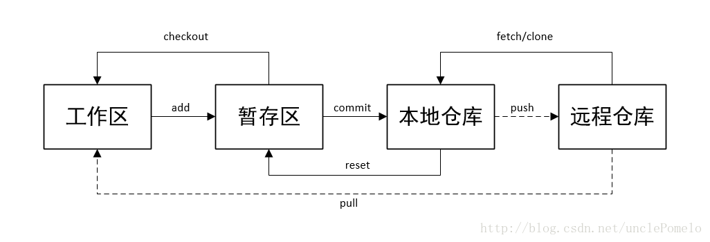

Git是工作中使用最多的一个工具，平时的代码也是用git来管理。分享一下平时使用最多的Git命令。
# Git结构图
先上一张Git结构图

<!-- more -->

# 命令
## 1、初始化git
git init   //创建
git clone path   //clone代码
git config --global user.email "you@examle.com"  //配置email
git config --global user.name  "name"  配置用户名

## 2、常用操作
git add <**file**>  //从workspace添加到暂存区(index)
git add .          //添加所有文件到暂存区
git commit -m "message"       //将暂存区的文件提交到本地仓库
git commit --amend   //与上次commit合并，可修改最新一条提交的change-id和message
git push origin master    //将本地仓库的修改推送至远程master分支(需要code review)
git pull                            //更新本地仓库（少用，推荐用下条命令）
git fetch && git rebase origin/master      //更新远程仓库至本地并合并到master分支
git status                        //查看修改的文件状态
git diff <**file**>                   //查看文件的修改内容
git show commit-id        //显示某次提交的内容
git show branch-name   //查看某个分支的最近提交的内容
git show commit-id --stat  //查看commit-id的提交修改了哪些文件

## 3、撤销
git reset  HEAD <**file**>     //将文件从暂存区恢复到工作区
git reset HEAD .                 //将所有文件从暂存区恢复到工作区
git checkout -- <**file**>         //将修改的文件恢复到最新提交后的状态
git checkout -- .                 //将所有修改的文件恢复到最新提交后的状态

## 4、分支
*一般修改都是在其他分支进行，最后将提交合并到主分支，所以掌握对分支的操作也是至关重要。*

git branch                                //查看当前分支
git branch -d branch-name      //删除 branch-name 分支
git checkout branch-name       //切换到 branch-name 分支
git cherry-pick commit-id          //合并其他分支的 commit 到当前分支
git checkout -b branch-name   //在当前分支的基础上创建一个新分支，并切换过去
git merge branch-name       //将branch-name分支的改动合并到当前分支
git checkout origin/remoteName -b localName   //获取远程分支removeName到本地新分支localName
git branch branch-name  SHA1_OF_HASH   //如果意外删除一个分支，可以重新创建它
git reflog                                                          //查看最近访问过的SHA1数
如果想看git rebase 和 git merge的选择时机，[请点我](https://github.com/geeeeeeeeek/git-recipes/wiki/5.1-%E4%BB%A3%E7%A0%81%E5%90%88%E5%B9%B6%EF%BC%9AMerge%E3%80%81Rebase-%E7%9A%84%E9%80%89%E6%8B%A9)

## 5、日志
git log                               //查看所有日志
git log -10                         //查看最新10条日志
git log --grep="message"  //查找含有指定内容的日志
git log | grep "message"    // 如上
git log --author="Name"       //根据作者查找日志，需加引号
git log <**file**>                       //查看指定文件的日志
git log -S "message"           //查看修改中含有“message”的日志
git log branch-name ^master   //查看master分支上没有的branch-name分支的内容，^表示非
git blame <**file**> | grep "message"  //找出谁修改了某个文件的message

## 6、冲突
git diff                            //对比差异
git diff HEAD                 //对比工作区和最后一次commit的差异
删除 <<<<, ====, >>>>等标记然后保存，需使用git add <file>和git commit -m "message"提交

未完待续...
