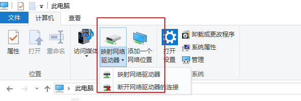
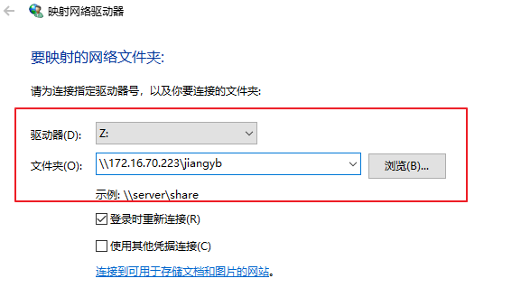
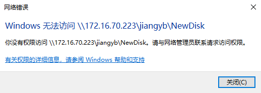
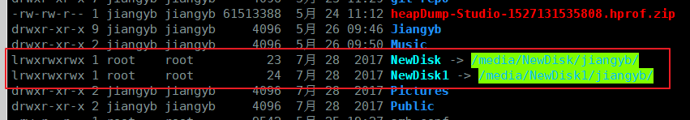

# 一、起因
最近公司和展讯有个合作项目，因此他们那边派人过来驻场开发。这是一个好的机会去了解更多的开发方式，原先 xshell+vim的方式实在效率太低，调试也不方便，被我百般吐槽。终于在和他们的沟通中了解到一个工具：samba。它可以实现Linux系统和Windows之间的资源共享。有了samba，从此在Windows上也可以通过Android Studio、Source Insight等IDE编辑调试Android源码了。  
废话不多说，直接上教程。

# 二、安装
```
sudo apt-get install samba (服务端)
sudo apt-get install smbclient （客户端，提供测试和Linux连接）
```
<!-- more -->
# 三、建立共享(配置文件)
## 1、创建共享目录
```
sudo mkdir -p /home/share
sudo chmod 777 /home/share
该目录也可以是其他,设置权限777之后所有人都可以读写
```
## 2、修改配置文件
**/etc/samba/smb.conf**
在 smb.conf 最后添加
```
[share]
	path = /home/share
	browseable = yes
	writable = yes
	comment = smb share test
```
### 常用配置
```
[share] #共享名,最后连接地址为 \\IP\share
comment = smb share test # 该共享的备注
path = /home/share # 共享路径
allow hosts = host(subnet) # 设置该Samba服务器允许的工作组或者域
deny hosts = host(subnet) # 设置该Samba服务器拒绝的工作组或者域
available = yes|no # 设置该共享目录是否可用
browseable = yes|no # 设置该共享目录是否可显示
writable = yes|no # 指定了这个目录缺省是否可写
public = yes|no # 指明该共享资源是否能给游客帐号访问
user = user, @group # user设置所有可能使用该共享资源的用户，也可以用@group代表group这个组的所有成员，不同的项目之间用空格或者逗号隔开
valid users = user, @group # 指定能够使用该共享资源的用户和组
invalid users = user, @group # 指定不能够使用该共享资源的用户和组
read list = user, @group # 指定只能读取该共享资源的用户和组
write list = user, @group # 指定能读取和写该共享资源的用户和组
admin list = user, @group # 指定能管理该共享资源（包括读写和权限赋予等）的用户和组
sync always = yes|no # 指明对该共享资源进行写操作后是否进行同步操作
short preserve case = yes|no # 指明是否区分文件名大小写
preserve case = yes|no # 指明是否保持大小写
case sensitive = yes|no # 指明是否对大小写敏感，一般选no，不然可能引起错误
mangle case = yes|no # 指明混合大小写
default case = upper|lower # 指明缺省的文件名是全部大写还是小写
force user = testuser # 强制把建立文件的属主是谁。如果我有一个目录，让guest可以写，那么guest就可以删除，如果我用force user= testuser强制建立文件的属主是testuser，同时限制create mask = 0755，这样guest就不能删除了
wide links = yes|no # 指明是否允许共享外符号连接，比如共享资源里面有个连接指向非共享资源里面的文件或者目录，如果设置wide links = no将使该连接不可用
max connections = 100 # 设定最大同时连接数
delete readonly = yes|no # 指明能否删除共享资源里面已经被定义为只读的文件
```
### 我的配置
```
[global]
	unix charset = UTF-8
	dos charset = cp936
	security = user
follow symlinks = yes
wide links = yes
unix extensions = no

[jiangyb]
	path = /home/jiangyb
	browseable = yes
	writable = yes
	available = yes
	comment = Share Folder require password
	create mask = 777
	directory mask = 777
	valid users = jiangyb
	force create mode = 0644
	force directory mode = 0644
	public = yes
	case sensitive = no
	short preserve case = yes
	sync always = yes
```
## 3、添加用户
注意，创建samba用户之前，必须先确保有一个同名的Linux用户，否则samba用户会创建失败
```
sudo smbpasswd -a username
(前提 username 用户已存在：useradd username)
接下来重复输入密码
smbpasswd命令：
smbpasswd -a 增加用户（要增加的用户必须以是系统用户）
smbpasswd -d 冻结用户，就是这个用户不能在登录了
smbpasswd -e 恢复用户，解冻用户，让冻结的用户可以在使用
smbpasswd -n 把用户的密码设置成空.
             要在global中写入 null passwords -true
smbpasswd -x  删除用户
```
## 4、多用户权限
需求：user1对file1有权限，user2对file2有权限
```
sudo chown user1:user2 /home/share/file1
sudo chmod 700 /home/share/file1

配置 smb.conf
[file1]
path = /home/share/file1
read only = no
public    = no
vaild users = user1
```
</br>

权限代码:
```
-rw------- (600) -- 只有属主有读写权限。
-rw-r--r-- (644) -- 只有属主有读写权限；而属组用户和其他用户只有读权限。
-rwx------ (700) -- 只有属主有读、写、执行权限。
-rwxr-xr-x (755) -- 属主有读、写、执行权限；而属组用户和其他用户只有读、执行权限。
-rwx--x--x (711) -- 属主有读、写、执行权限；而属组用户和其他用户只有执行权限。
-rw-rw-rw- (666) -- 所有用户都有文件读、写权限。
-rwxrwxrwx (777) -- 所有用户都有读、写、执行权限。
```
</br>

# 四、重启samba服务
```
sudo service smbd restart
或者
sudo /etc/init.d/smbd restart
```
</br>

# 五、客户端连接
## 1、Windows
```
我的电脑 --> 映射网络驱动器 --> 选择驱动器，文件夹填入 \\IP\share dir
--> 输入刚才创建的用户名密码
```
  

  
## 2、Linux
```
1、 安装 cifs
sudo apt-get install cifs-utils
2、列出远程目录
smbclient -L ip_address -Uadministrator (ip_address 自行替换)
3、本地新建一个目录用来挂载远程目录
mkdir -p /home/jiangyb/samba
4、修改 /etc/fstab
//ip_address/share_dir/ /local_dir/ cifs defaults, username=user, password=pwd,
uid=500, gid=500
例：
//172.16.70.223/jiangyb /home/jiangyb/samba cifs defaults, username=jiangyb,
password=jiangyb, uid=500, gid=500
5、 挂载
sudo mount -a
```
</br>

# 六、其他命令
## 1、查看已启用的samba账户
```
sudo pdbedit -L -v
-L 列出用户
-v 列出详细内容
```
## 2、配置samba开机启动
```
sudo vim /etc/rc.local
在exit 0 之前添加如下内容：
/etc/init.d/smbd start
```
</br>
# 七、问题
使用过程中，发现有两个文件夹无法访问
  
</br>
通过 ls -l /home/jiangyb命令发现 NewDisk和NewDisk1是两个符号链接目录  


**解决**
修改 **/etc/samba/smb.conf** 文件  
在 **[global]** 下加入如下内容：
```
follow symlinks = yes  
wide links = yes  
unix extensions = no
```
