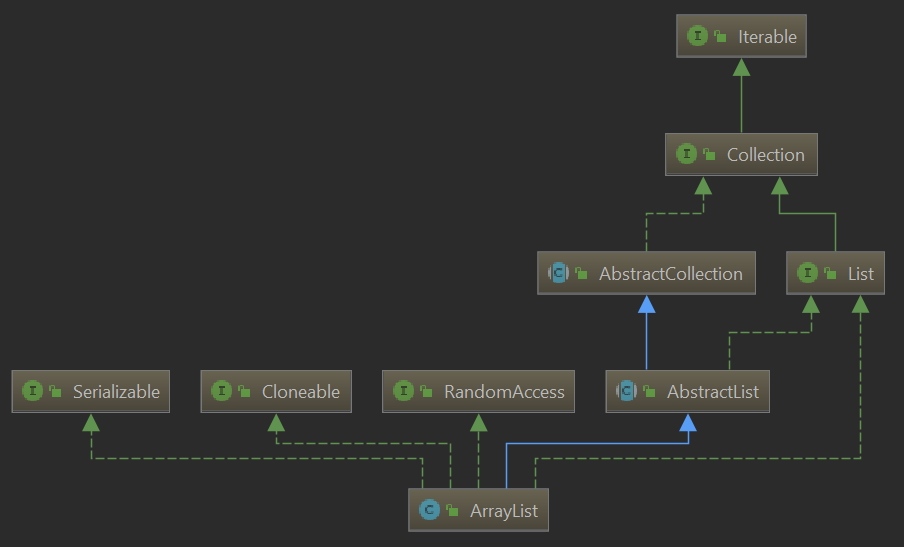

**本文的分析基于Java 1.8源码。**

ArrayList是线性表的实现之一,也是我们平常开发中用的最多的一种容器类。

今天就讲讲其源码实现。

先来看看其类图。



可以看到其继承自AbstractList类,也是Collection的子类之一，同时实现了Serializable、Cloneable、RandomAccess接口。

1. 实现Serializable接口:支持序列化 
2. 实现Cloneable接口:能被克隆
3. 实现RandomAccess接口:可以通过下标随机访问

<!-- more -->

## 成员变量
```java
public class ArrayList<E> extends AbstractList<E>
        implements List<E>, RandomAccess, Cloneable, java.io.Serializable
{
    private static final long serialVersionUID = 8683452581122892189L;
    private static final int DEFAULT_CAPACITY = 10;
    private static final Object[] EMPTY_ELEMENTDATA = {};
    private static final Object[] DEFAULTCAPACITY_EMPTY_ELEMENTDATA = {};
    transient Object[] elementData;
    private int size;
}
```


<table>
	<tr>
		<td>serialVersionUID</td>
		<td>序列化验证版本一致性字段</td>
	</tr>
	<tr>
		<td>DEFAULT_CAPACITY</td>
		<td>默认容量大小</td>
	</tr>
	<tr>
		<td>EMPTY_ELEMENTDATA</td>
		<td>static修饰的空数组,存在常量池,用于指定容量为0时的初始化</td>
	</tr>
	<tr>
		<td>DEFAULTCAPACITY_EMPTY_ELEMENTDATA</td>
		<td>同上,用于无参数构造的初始化</td>
	</tr>
	<tr>
		<td>elementData</td>
		<td>用于保存添加到ArrayList中的元素</td>
	</tr>
	<tr>
		<td>size</td>
		<td>ArrayList的大小</td>
	</tr>
</table>



## 构造函数
```java
public ArrayList() {
	this.elementData = DEFAULTCAPACITY_EMPTY_ELEMENTDATA;
}

public ArrayList(int initialCapacity) {
    if (initialCapacity > 0) {
        this.elementData = new Object[initialCapacity];
    } else if (initialCapacity == 0) {
        this.elementData = EMPTY_ELEMENTDATA;
    } else {
        throw new IllegalArgumentException("Illegal Capacity: "+
                                           initialCapacity);
    }
}

public ArrayList(Collection<? extends E> c) {
    elementData = c.toArray();
    if ((size = elementData.length) != 0) {
        if (elementData.getClass() != Object[].class)
            elementData = Arrays.copyOf(elementData, size, Object[].class);
    } else {
        // replace with empty array.
        this.elementData = EMPTY_ELEMENTDATA;
    }
}
```

可以看到ArrayList共有三个构造函数

1. ArrayList():默认的构造函数,默认初始容量为10,并赋予一个在常量池中存在的空数组
2. ArrayList(int initialCapacity):指定容量的构造,如果容量等于0,则赋予一个空数组,反之则在堆区创建一个指定大小的Object数组,并将elementData指向该数组
3. ArrayList(Collection<? extends E> c):将传入的集合中的元素复制到ArrayList中。先将传入的集合转为数组赋值给elementData,然后判断数组是否为Object[]类型,如果不是的话就通过Arrays.copyOf()将数组中的元素拷贝到elementData中。若传入集合大小为0,给elementData复制一个空数组。


## 常用操作

ArrayList类有多个方法,接下来就列举一些常用的方法来讲解。

### ensureCapacity()
扩容操作
```java
public void ensureCapacity(int minCapacity) {
    int minExpand = (elementData != DEFAULTCAPACITY_EMPTY_ELEMENTDATA)
        ? 0 
        : DEFAULT_CAPACITY;
    if (minCapacity > minExpand) {
        ensureExplicitCapacity(minCapacity);
    }
}

private void ensureExplicitCapacity(int minCapacity) {、
	//modCount为改变ArrayList结构的次数
    modCount++;
    if (minCapacity - elementData.length > 0)
        grow(minCapacity);
}

private void grow(int minCapacity) {
    int oldCapacity = elementData.length;
    int newCapacity = oldCapacity + (oldCapacity >> 1);
    if (newCapacity - minCapacity < 0)
        newCapacity = minCapacity;
    if (newCapacity - MAX_ARRAY_SIZE > 0)
        newCapacity = hugeCapacity(minCapacity);
    elementData = Arrays.copyOf(elementData, newCapacity);
}
```

minExpand这个局部变量取决于elementData的数据情况,如果elementData是一个空数组,则minExpand=0,反之为默认容量10。接下来判断传入的容量是否大于minExpand,判断成立的话会调用ensureExplicitCapacity()进行扩容。
在ensureExplicitCapacity里又判断传入的容量大小是否大于ArrayList内部数组elementData的大小,成立的话最终调用grow()。
ArrayList最终的大小有三种可能:minCapacity、原数组的1.5倍、hugeCapacity()方法的返回值。
最后通过Arrays.copyOf()将旧数组的数据复制到新数组。

### add()

添加操作

```java
public boolean add(E e) {
    //也是调用ensureExplicitCapacity来进行扩容
    ensureCapacityInternal(size + 1);
    elementData[size++] = e;
    return true;
}

public void add(int index, E element) {
    rangeCheckForAdd(index);
    ensureCapacityInternal(size + 1);
    System.arraycopy(elementData, index, elementData, index + 1,
                     size - index);
    elementData[index] = element;
    size++;
}
```

add有两个重载方法。
add(E e):1、扩容 2、将元素添加到elementData数组尾部,时间复杂度为O(1)
add(int index, E element):1、检查下标越界  2、扩容  3、从下标index开始,依次复制到后一个位置  4、将元素添加到数组下标index处 5、将size+1,该方法最坏的时间复杂度为O(n)

### remove()
移除元素
```java
public E remove(int index) {
    rangeCheck(index);
    modCount++;
    E oldValue = elementData(index);
    int numMoved = size - index - 1;
    if (numMoved > 0)
        System.arraycopy(elementData, index+1, elementData, index,
                         numMoved);
    elementData[--size] = null; // clear to let GC do its work
    return oldValue;
}

public boolean remove(Object o) {
    if (o == null) {
        for (int index = 0; index < size; index++)
            if (elementData[index] == null) {
                fastRemove(index);
                return true;
            }
    } else {
        for (int index = 0; index < size; index++)
            if (o.equals(elementData[index])) {
                fastRemove(index);
                return true;
            }
    }
    return false;
}

private void fastRemove(int index) {
    modCount++;
    int numMoved = size - index - 1;
    if (numMoved > 0)
        System.arraycopy(elementData, index+1, elementData, index,
                         numMoved);
    elementData[--size] = null; 
}
```

remove也有两个重载方法

remove(int index):1、检查下标越界  2、取出下标index处的元素 3、调用System.arraycopy()将下标index+1处的元素依次复制到index处  4、将最后一个元素置为null,并将size-1 ,该方法最坏时间复杂度O(n)
remove(Object o):若传入参数为null,则遍历elementData数组,找到第一个为null的位置,调用fastRemove()来移除元素。若传入元素不为null,同样遍历elementData,找到与传入参数地址一致的对象位置,调用fastRemove()
fastRemove()方法与remove(int index)类似,不再分析。
remove()方法的时间复杂度为O(n)

### get()

获取指定位置的元素

```java
public E get(int index) {
    rangeCheck(index);
    return elementData(index);
}
```

get方法先进行下标检查,随后返回elementData数组的index位置元素。 时间复杂度O(1)

### set()

设置指定位置的元素

```java
public E set(int index, E element) {
    rangeCheck(index);
    E oldValue = elementData(index);
    elementData[index] = element;
    return oldValue;
}
```
set方法先进行下标检查,随后将elementData数组的index位置设置为传入的元素,返回elementData原先的index位置元素。时间复杂度O(1)

### contains()

判断是否包含某个元素

```java
public boolean contains(Object o) {
    return indexOf(o) >= 0;
}

public int indexOf(Object o) {
    if (o == null) {
        for (int i = 0; i < size; i++)
            if (elementData[i]==null)
                return i;
    } else {
        for (int i = 0; i < size; i++)
            if (o.equals(elementData[i]))
                return i;
    }
    return -1;
}
```

contains方法会调用indexOf()来返回元素的下标,若返回-1,则代表没有该元素。
indexOf():通过遍历elementData数组来返回元素下标
最坏时间复杂度O(n)

### trimToSize()
去除扩容后未存放元素的预留空间。
```java
public void trimToSize() {
    modCount++;
    if (size < elementData.length) {
        elementData = (size == 0)
          ? EMPTY_ELEMENTDATA
          : Arrays.copyOf(elementData, size);
    }
}
```

### sort()
对列表的元素进行排序
```java
public void sort(Comparator<? super E> c) {
    final int expectedModCount = modCount;
    Arrays.sort((E[]) elementData, 0, size, c);
    if (modCount != expectedModCount) {
        throw new ConcurrentModificationException();
    }
    modCount++;
}
```
调用Arrays.sort()进行排序。

## 总结
1、ArrayList底层是基于数组来实现的,因此set/get的效率特别高,但add/remove的效率较低
2、ArrayList的默认容量是10
3、ArrayList会自动扩容,会扩容成1.5倍,如果1.5倍比我们指定的容量小的话,会扩容成指定容量。如果容量太大,则直接扩容成Integer.MAX_VALUE或MAX_ARRAY_SIZE(Integer.MAX_VALUE - 8)
4、ArrayList不是线程安全的